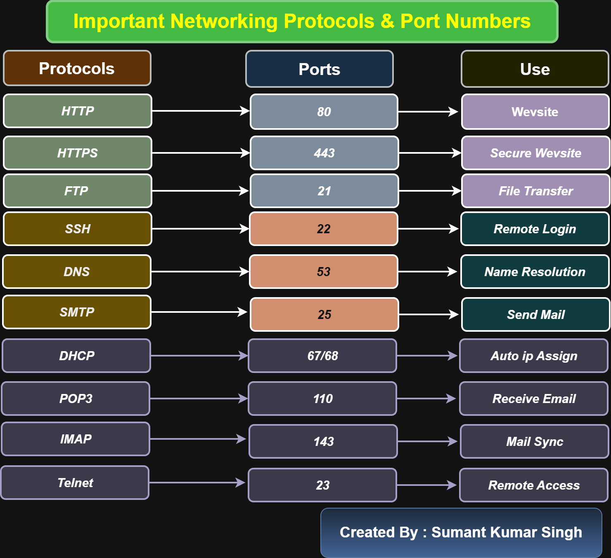

Networking Challenge

Overview

This repository contains networking concepts and diagrams created as part of my DevOps learning journey.

Topics Covered

- OSI Model
- TCP/IP Model
- Networking Basics
- Important Protocols & Ports
- AWS EC2 & Security Groups

OSI Model

The OSI model contains 7 layers:

1. Application Layer
2. Presentation Layer
3. Session Layer
4. Transport Layer
5. Network Layer
6. Data Link Layer
7. Physical Layer

TCP/IP Model

The TCP/IP model contains 4 layers:

1. Application Layer
2. Transport Layer
3. Internet Layer
4. Network Access Layer

Tools Used

- Draw.io
- GitHub
- AWS EC2

Author

Sumant Kumar

Conclusion

This project helped me understand networking concepts, OSI model, TCP/IP model, and cloud networking basics.

## Important Networking Protocols & Ports

This diagram explains commonly used networking protocols, their port numbers, and their usage in networking and DevOps.

### Topics Included
- HTTP – Port 80
- HTTPS – Port 443
- FTP – Port 21
- SSH – Port 22
- DNS – Port 53
- SMTP – Port 25
- DHCP – Port 67/68
- POP3 – Port 110
- IMAP – Port 143
- Telnet – Port 23

### Diagram

